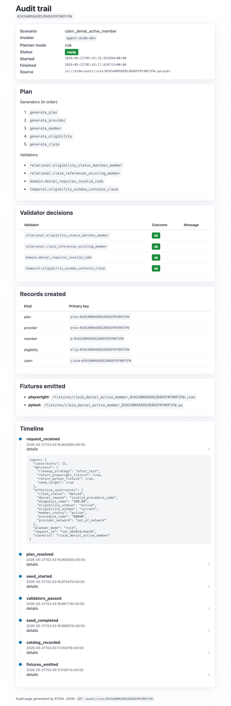
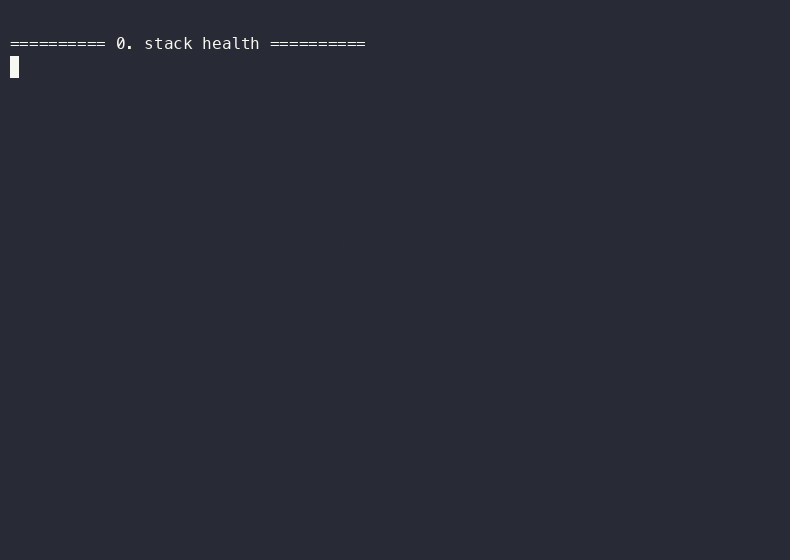

# Agentic Test Data Manager (ATDM)

> AI-augmented test-data platform. Automation engineers and AI testing agents
> request scenario-grounded synthetic data by intent, consume it via
> framework-native fixtures, and reset cleanly afterward — with a full audit
> trail of every action the agent took.

[](https://github.com/NickBaynham/agentic-test-data-manager/actions/workflows/ci.yml)
[](LICENSE)
[](https://www.python.org/downloads/release/python-3120/)

## What this proves

- **Safe agentic QA architecture.** The agent's plan is gated by deterministic
  validators before any SQL fires. The "no SQL from agent code" claim is a
  CI-enforced architecture fitness test, not documentation.
- **Test data lifecycle competence.** Generate, seed, audit, reset, restore.
  All five reset strategies (`reset_run`, `reset_all`, `baseline_snapshot`,
  `baseline_restore`, `idempotent_seed`) live and demoable.
- **API design for autonomous testing agents.** `POST /test-data/requests`
  returns a complete contract: entity PKs, fixture file paths, a one-time
  cleanup token, and an audit URL.
- **Quality intelligence wired in.** Every scenario carries
  `linked_requirement_ids[]` so future phases can join scenarios to
  requirements and surface coverage gaps.



*Above: `GET /ui/audit/{run_id}` — server-rendered HTML page showing one
scenario run from request through reset. Pico.css from a CDN, no
JavaScript build. The full audit trail and its underlying Parquet schema
are documented in [docs/design-decisions.md](docs/design-decisions.md).*

## Prerequisites

| Tool | Required for | Install |
|---|---|---|
| Python 3.12 | runtime | `brew install python@3.12` (or pyenv) |
| pdm 2.26+ | package management | `brew install pdm` |
| Docker Engine 24+ | local stack | Docker Desktop or `brew install docker` + colima |
| Docker Compose v2 | service orchestration | bundled with Docker Desktop |
| GNU Make | task runner | bundled with macOS / Linux toolchains |
| Node.js 20+ | Playwright example, `make audit-screenshot` | `brew install node` |
| asciinema | recording the demo (`make demo-cast`) | `brew install asciinema` |

The first five are required to run `make demo`. Node, asciinema, and `agg`
are only required for the Playwright example and for regenerating the
screenshot / demo cast under `docs/assets/`.

**On macOS, `make setup` handles the optional installs for you.** It
checks for `docker` and `pdm` (errors out if missing), auto-installs
`node`, `asciinema`, and `agg` via Homebrew if absent, then runs
`pdm install`. On other systems, `make setup` skips the brew step and just
runs `pdm install`; install the optional tools manually if you need them.

## Try it (90 seconds)

```bash
make setup       # verify tools + brew install missing ones + pdm install
make up          # docker compose, all services healthy (~18s p95)
make demo        # full intent → seed → test → reset → audit loop (~3s)
```

The demo prints a URL to open in a browser. See
[docs/demo-script.md](docs/demo-script.md) for a step-by-step walkthrough.



*Above: `make demo` recorded with `make demo-cast`. The raw asciinema cast
is at [docs/assets/demo.cast](docs/assets/demo.cast) — replay it with
`asciinema play docs/assets/demo.cast`.*

## What `make demo` does

1. Hits the agent's health probe.
2. Calls `atdm request claim_denial_active_member --playwright --pytest`.
3. Runs `automation/pytest-api/test_example_claim_denial.py` against the
   just-emitted fixture file.
4. Calls `atdm reset <run_id>` with the cleanup token.
5. Prints the audit trail JSON.
6. Prints the URL to the HTML audit UI.

Total wall time on a warm stack: **~3 seconds.** Budget: 90 seconds.

## Architecture

```
   Reviewer / dev                   docker compose
       |                                  |
       |  atdm CLI                   +----+----+
       |  @atdm_scenario --->        | Agent   |---+
       |  Browser (audit UI)         |  :8001  |   |  POST /internal/scenarios/seed
       |                             +----+----+   |  (atomic Postgres txn)
                                          |        v
                                          |    +-------+      +----------+
                                          +--->|  SUT  +----->| Postgres |
                                          |    | :8000 |      +----------+
                                          |    +-------+
                                          |        |
                                          |        v
                                          |    +-------+
                                          +--->| MinIO |  audit / catalog
                                               +-------+  / fixtures (Parquet)
```

Full diagram with a mermaid component graph: [docs/architecture.md](docs/architecture.md).

## Documentation index

| Question | Doc |
|---|---|
| 90-second demo walkthrough | [docs/demo-script.md](docs/demo-script.md) |
| Recruiter / portfolio summary | [docs/recruiter-summary.md](docs/recruiter-summary.md) |
| Architectural calls + worked-example audit | [docs/design-decisions.md](docs/design-decisions.md) |
| Component diagram and data flow | [docs/architecture.md](docs/architecture.md) |
| Domain model (7 entities, ID conventions, CHECK constraints) | [docs/healthcare-domain-model.md](docs/healthcare-domain-model.md) |
| Dev guide (testing, CLI, troubleshooting) | [docs/development.md](docs/development.md) |
| Original concept | [requirements/concept.md](requirements/concept.md) |
| Business requirements | [requirements/BRD.md](requirements/BRD.md) |
| Engineering handoff | [requirements/engineering-handoff.md](requirements/engineering-handoff.md) |
| Phase-by-phase build plan | [planning/PLAN.md](planning/PLAN.md) |
| What's shipped | [FEATURES.md](FEATURES.md) |
| What's coming | [TODO.md](TODO.md) |
| Per-PR changes + lessons learned | [CHANGELOG.md](CHANGELOG.md) |

## Quickstart for users

### CLI

```bash
# After `make up`:
atdm scenarios                                    # list registered scenarios
atdm request claim_denial_active_member           # request data
atdm -o json audit <run_id>                       # inspect the trail
atdm reset <run_id> --token <cleanup_token>       # tear it down
atdm baseline-snapshot --baseline-id golden       # capture a baseline
atdm baseline-restore --baseline-id golden        # restore later
```

### pytest

```python
from atdm.pytest import atdm_scenario

@atdm_scenario("active_member_clean")
def test_member(atdm_data):
    assert atdm_data["data"]["member_id"].startswith("m-")
    # No cleanup needed — the fixture's teardown calls /reset for you.
```

### Direct HTTP

```bash
curl -X POST http://localhost:18001/test-data/requests \
  -H 'authorization: Bearer dev-token-change-me' \
  -H 'content-type: application/json' \
  -d '{"scenario":"active_member_clean"}'
```

Swagger UI at `http://localhost:18001/docs`.

## Host port mapping

The stack uses non-default host ports so it doesn't collide with other
projects:

| Service | Host port |
|---|---|
| Postgres | `55432` |
| MinIO API | `19000` |
| MinIO Console | `19001` (default creds in `.env.example`) |
| Target SUT | `18000` |
| ATDM agent | `18001` |

Container-internal ports are conventional; only the host side is remapped.
See [planning/PLAN.md Phase 1](planning/PLAN.md#phase-1--docker-compose-postgres-minio-two-service-stubs).

## Security model

This is portfolio-grade, not production-grade. Specifically:

- **Authentication**: a single shared API token (`ATDM_API_TOKEN` env var)
  protects every mutating endpoint. Multi-user / RBAC is Phase 4+.
- **Read endpoints are open on the local network**: `/health`, `/metrics`,
  `/audit/runs/...`, `/ui/audit/...`, `/catalog/scenarios`,
  `/test-data/baseline/list`. This is acceptable here because **no real
  data ever lives in this system** (see Data ethics below).
- **Cleanup tokens** are stored as `sha256` only (DR-007). Plaintext is
  returned once at request time and never persisted.
- **Audit log is append-only** at the application layer — there is no
  HTTP route that deletes or modifies past audit events. Enforced by an
  architecture fitness test (NFR-011) that gates CI.

If a real consumer ever shows up, see
[requirements/BRD.md §18 Phase 4](requirements/BRD.md) for the production
hardening roadmap.

## Data ethics

All generated data is synthetic (NFR-010). The schema enforces three
markers via database CHECK constraints, double-checked at the application
layer:

- Names: `FAKE_` prefix on every `first_name` and `last_name`.
- Addresses: state code is always `ZZ` (a fictional state).
- Identifiers: `npi_fake` field is just a numeric string, not a real NPI.

There is no PHI, no real SSN-shaped data, and no real claims data anywhere
in this repo. See [docs/healthcare-domain-model.md](docs/healthcare-domain-model.md)
for the full data dictionary and example records.

## Testing

The project ships four test layers:

| Layer | How to run | Count |
|---|---|---|
| Unit (per source root) | `make test` | 78 |
| Architecture fitness | included in `make test` | 5 |
| Integration (live stack) | `make test-integration` | 58 |
| E2E (warm-start budget) | included in `make test-integration` | 1 |

**142 tests total** across unit, integration, and e2e. The architecture
fitness tests gate CI — any agent-side SQL, any audit-mutation route, or
any emoji in committed text fails the build.

## Conventions

- **Python**: 3.12, `pdm`-managed, `ruff` + `mypy --strict` clean.
- **Containers**: Docker Compose for the local stack; 512 MB memory limit
  per long-running service.
- **Code style**: no emojis (NFR-012; enforced by an architecture fitness
  test). Short comments only where the *why* is non-obvious.
- **Commits**: one phase per merge to `main`. CHANGELOG + FEATURES + TODO
  updated with every merge. Lessons learned written into PLAN.md as
  "Known pitfalls" so the next replay avoids them.

## License

MIT. See [LICENSE](LICENSE).

## Author

Nick Baynham — [nickbaynham@gmail.com](mailto:nickbaynham@gmail.com).
Portfolio piece for QA architect / test-automation roles. The full project
narrative (concept → BRD → engineering handoff → 10-phase plan → 142
tests) is intentional and reviewable.
