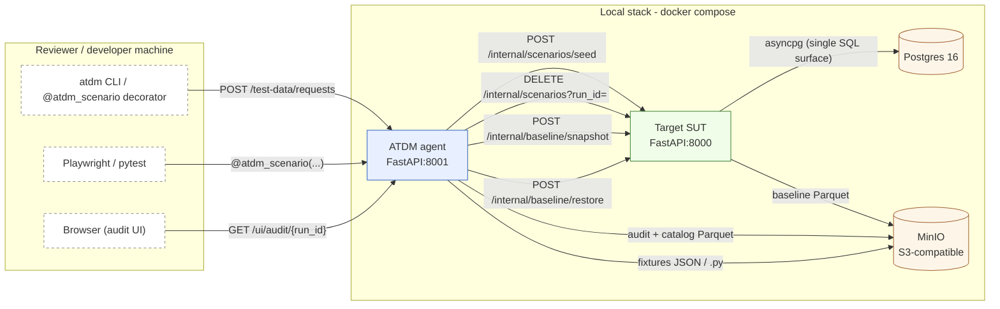

# Architecture

ATDM is two FastAPI services and a small ecosystem of stores, glued together
by a deterministic agent that requests, validates, seeds, and reverses test
data on demand.

## Component diagram

## Components

### ATDM agent (`apps/test-data-agent/`)

FastAPI service on port 18001 (container 8001). The agent **never writes
SQL** — AR-003. Every state mutation flows through the Target SUT's HTTP
API. Responsibilities:

- **Scenario registry** — loads `app/scenarios/*.yaml` at startup.
- **Rule-based planner** — turns `{scenario, constraints}` into an ordered
  list of generator calls.
- **Deterministic generators** — pure functions that produce records.
  Seeded from the `test_run_id` so re-running yields identical values.
- **Validators** — cross-entity consistency checks (relational, domain,
  temporal). A failed validator emits `plan_rejected` and never reaches
  the SUT.
- **Seeder** — builds the bundle, POSTs to the SUT atomically.
- **Catalog writer** — one Parquet object per run in `atdm-catalog`,
  carrying the sha256 of the cleanup token (never plain).
- **Audit writer** — append-only Parquet in `atdm-audit`, one object per
  run. Every event has `{event_id, timestamp, test_run_id, invoker,
  action, inputs, tools_called, outputs, status, schema_version}`.
- **Strategy endpoints** — `reset_all`, `baseline_snapshot`,
  `baseline_restore`, `baseline_list`.
- **Audit UI** — server-rendered HTML at `/ui/audit/{run_id}`.

### Target SUT (`apps/target-healthcare-api/`)

FastAPI service on port 18000 (container 8000). Owns the **healthcare
schema** (7 entities: Plan, Provider, Member, Eligibility, Claim,
ProcedureCode, DiagnosisCode). Repositories are the **single SQL surface
per table**; parameterized queries only. Responsibilities:

- Per-entity routes for direct entity testing (`POST /internal/members`
  etc.).
- **Atomic bundle endpoint** `POST /internal/scenarios/seed` — one Postgres
  transaction, FK-safe order.
- **Atomic bundle delete** `DELETE /internal/scenarios?run_id=...`.
- **Baseline snapshot/restore** server-side via PyArrow + MinIO.
- Database migrations via `docker-entrypoint-initdb.d/`.

### Postgres 16

The Target SUT's database. Every mutable row carries `test_run_id`. Database
CHECK constraints enforce NFR-010 markers (`FAKE_` prefix, `ZZ` state code)
as a second line of defense behind Pydantic validation.

### MinIO (S3-compatible)

Three buckets:
- `atdm-catalog/` — one Parquet object per ScenarioRequest + baseline
  manifests.
- `atdm-audit/` — one Parquet object per run, append-only.
- `atdm-fixtures/` — currently unused (Phase 6 writes fixtures to the
  bind-mounted `automation/fixtures/` directory instead).

### atdm-client package (`apps/test-data-agent/python/`)

Installable Python package providing:

- `atdm` console script (Typer) — 8 subcommands wrapping the agent's HTTP
  API.
- `AtdmClient` — sync httpx wrapper for direct Python use.
- `atdm.pytest` plugin — `@atdm_scenario("...")` decorator + `atdm_data`
  fixture. Auto-loads via pytest11 entry point.

## Request lifecycle (the demoable path)

For `POST /test-data/requests`, the agent emits this audit trail in order:

1. **`request_received`** — captures the raw request and the effective
   constraints (defaults merged with caller overrides).
2. **`plan_resolved`** — names the scenario, the generators, and the
   validators.
3. **`seed_started`** — about to invoke the seeder.
4. **`validators_passed`** OR **`plan_rejected`** — the deterministic
   validators ran; if any failed, the bundle never reaches the SUT
   (HTTP 422 with `VALIDATOR_REJECTED`).
5. **`seed_completed`** OR **`seed_failed`** — the bundle insert
   succeeded or rolled back atomically.
6. **`fixtures_emitted`** (optional) — if the request asked for Playwright
   or pytest fixtures.
7. **`catalog_recorded`** — the run is now known to the catalog with its
   cleanup token hash.

A subsequent `POST /test-data/runs/{run_id}/reset` emits two more events:

8. **`reset_started`** — strategy = `reset_run`, token verified.
9. **`reset_completed`** with `status: cleaned` — atomic bundle DELETE
   finished.

This 9-event trail is what the reviewer sees in
`/ui/audit/{run_id}` and the [audit-trail screenshot](assets/audit-trail.png).

## Architectural rules (mechanically enforced)

| Rule | Where | Enforced by |
|---|---|---|
| Agent never writes SQL (AR-003) | `apps/test-data-agent/app/` | `tests/architecture/test_no_sql_from_agents.py` — greps for forbidden imports and SQL-shaped literals |
| Audit log is append-only (NFR-011) | `apps/test-data-agent/app/audit/` | `tests/architecture/test_audit_log_append_only.py` — no DELETE/PUT/PATCH route, no mutator-named functions |
| No emoji anywhere (NFR-012) | All committed text | `tests/architecture/test_no_emoji.py` — scans for emoji code points |
| Atomic seeding (FR-014) | `POST /internal/scenarios/seed` | Single Postgres transaction; FK / CHECK / unique violations roll back |
| NFR-010 markers | Pydantic + DB CHECK | Two validation layers; bypassing one still fails the other |
| Cleanup tokens stored as sha256 (DR-007) | Catalog Parquet | Plaintext returned once at request time, never persisted |

These are CI-gated. A future refactor that weakens them fails the build
before merge.

## Why these calls

The full rationale lives in [design-decisions.md](design-decisions.md). The
short version: ATDM's portfolio claim is **safe, auditable agent → data
plumbing → reversible cleanup**, and every architectural decision exists to
serve that claim.
