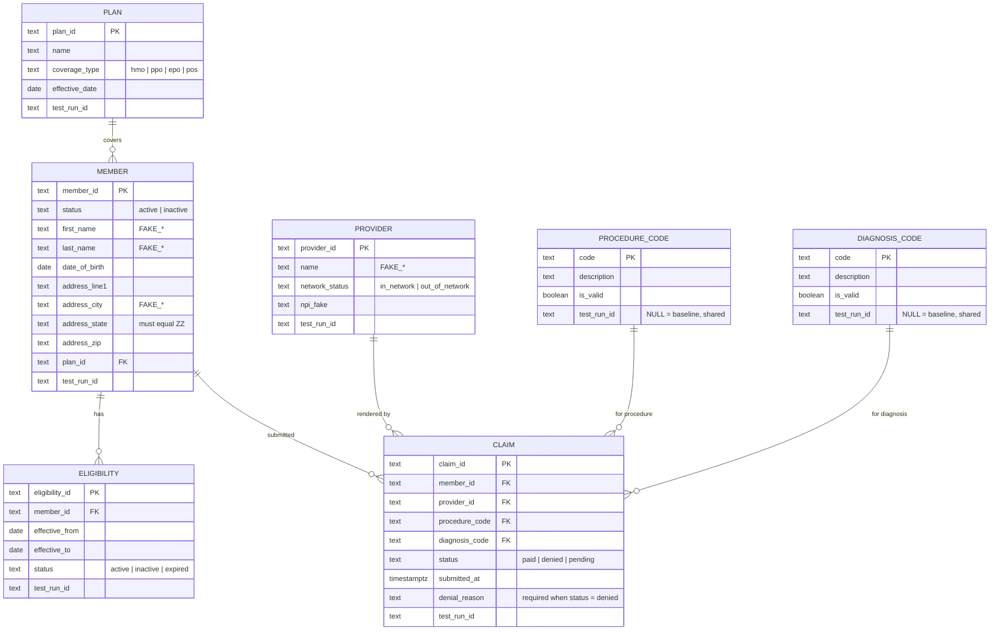

# Synthetic Healthcare Domain Model

ATDM's portfolio domain is a deliberately simplified healthcare-payer
schema. It is **not** an EDI-conformant claims system; it borrows enough
vocabulary to make scenarios like "denied claim from an out-of-network
provider" demoable without becoming a domain ratholes.

> **All data is synthetic.** Per NFR-010: every first/last name carries the
> `FAKE_` prefix; every address uses the fictional state code `ZZ`; no real
> NPI numbers, SSNs, or PHI of any kind exist anywhere in this system. The
> CHECK constraints in `migrations/0001_init.sql` enforce these markers at
> the DDL layer, and Pydantic validators enforce them at the application
> boundary.

## Entity catalog



### Mutable tables

Five tables carry `test_run_id NOT NULL` with an index. This powers
`reset_run` (delete all rows for a run) and `reset_all` (delete every
test-tagged row, preserve baseline reference data).

| Table | Purpose | FK in | FK out |
|---|---|---|---|
| `plan` | Insurance plan / coverage tier | — | `member.plan_id` |
| `provider` | Healthcare provider (clinic, doctor group) | — | `claim.provider_id` |
| `member` | Insured individual | `plan_id` | `eligibility.member_id`, `claim.member_id` |
| `eligibility` | Coverage window per member | `member_id` | — |
| `claim` | Service request submitted to the payer | `member_id`, `provider_id`, `procedure_code`, `diagnosis_code` | — |

### Reference tables (two-tier)

Procedure codes and diagnosis codes have a two-tier model:

- **Baseline** rows (`test_run_id IS NULL`): shared across every run. Seeded
  by the migration. Currently 4 procedure codes (3 valid + 1 invalid
  "denial driver") and 4 diagnosis codes (3 valid + 1 invalid).
- **Per-run** rows (`test_run_id = '<some_run>'`): a scenario can attach a
  per-run invalid code to drive a denial without polluting the baseline.
  Deleted with the run.

Baseline codes available out of the box:

| Procedure code | Description | is_valid |
|---|---|---|
| `99213` | Office visit, established patient | yes |
| `99214` | Office visit, established patient, moderate | yes |
| `70553` | MRI brain with and without contrast | yes |
| `00000` | Synthetic invalid procedure code (denial driver) | no |

| Diagnosis code | Description | is_valid |
|---|---|---|
| `Z00.00` | Encounter for general adult medical examination | yes |
| `M54.5` | Low back pain | yes |
| `R51` | Headache | yes |
| `ZZZ.99` | Synthetic invalid diagnosis code (denial driver) | no |

## ID conventions

All generated IDs use the `{kind}-{test_run_id}` pattern so any generator
can derive a sibling's PK without state passing:

| Entity | Generated ID pattern |
|---|---|
| Plan | `plan-{test_run_id}` |
| Provider | `prov-{test_run_id}` |
| Member | `m-{test_run_id}` |
| Eligibility | `elig-{test_run_id}` |
| Claim | `claim-{test_run_id}` |
| Per-run ProcedureCode | `PC-{test_run_id}` |
| Per-run DiagnosisCode | `DC-{test_run_id}` |

`test_run_id` is a [ULID](https://github.com/ulid/spec), so IDs are sortable
by creation time and globally unique.

## CHECK constraints (defense in depth)

Pydantic validators reject bad inputs at the API boundary (HTTP 422 before
any SQL fires). Database CHECK constraints catch anything that bypasses
Pydantic — e.g., direct `psql` insert or a misbehaving migration.

| Table | Constraint |
|---|---|
| `plan` | `coverage_type IN ('hmo','ppo','epo','pos')` |
| `provider` | `network_status IN ('in_network','out_of_network')` |
| `member` | `status IN ('active','inactive')` |
| `member` | `first_name LIKE 'FAKE\_%'` (NFR-010) |
| `member` | `last_name LIKE 'FAKE\_%'` (NFR-010) |
| `member` | `address_state = 'ZZ'` (NFR-010) |
| `eligibility` | `status IN ('active','inactive','expired')` |
| `eligibility` | `effective_to >= effective_from` |
| `claim` | `status IN ('paid','denied','pending')` |
| `claim` | denied claims require `denial_reason NOT NULL` |

## Example records

Below is the exact bundle that ATDM seeds for the `claim_denial_active_member`
scenario when default constraints apply.

```json
{
  "plan": {
    "plan_id": "plan-01KS3J3H4D",
    "name": "Silver Health Plan",
    "coverage_type": "ppo",
    "effective_date": "2026-01-01",
    "test_run_id": "01KS3J3H4D"
  },
  "provider": {
    "provider_id": "prov-01KS3J3H4D",
    "name": "FAKE_Clinic_Davis",
    "network_status": "out_of_network",
    "npi_fake": "0123456789",
    "test_run_id": "01KS3J3H4D"
  },
  "member": {
    "member_id": "m-01KS3J3H4D",
    "status": "active",
    "first_name": "FAKE_Iris",
    "last_name": "FAKE_Brown",
    "date_of_birth": "1985-04-12",
    "address": {
      "line1": "423 FAKE_Main_St",
      "city": "FAKE_Springfield",
      "state": "ZZ",
      "zip": "00423"
    },
    "plan_id": "plan-01KS3J3H4D",
    "test_run_id": "01KS3J3H4D"
  },
  "eligibility": {
    "eligibility_id": "elig-01KS3J3H4D",
    "member_id": "m-01KS3J3H4D",
    "effective_from": "2025-12-02",
    "effective_to": "2026-12-03",
    "status": "active",
    "test_run_id": "01KS3J3H4D"
  },
  "claim": {
    "claim_id": "claim-01KS3J3H4D",
    "member_id": "m-01KS3J3H4D",
    "provider_id": "prov-01KS3J3H4D",
    "procedure_code": "00000",
    "diagnosis_code": "Z00.00",
    "status": "denied",
    "submitted_at": "2026-06-01T12:00:00+00:00",
    "denial_reason": "invalid_procedure_code",
    "test_run_id": "01KS3J3H4D"
  }
}
```

This bundle is inserted in **one Postgres transaction** in FK-safe order:
codes → plan → provider → member → eligibility → claim. Any constraint
violation (FK / CHECK / unique) rolls the whole bundle back atomically.

## Why "Synthetic healthcare" and not a real domain

A real healthcare schema (Facets, QNXT, EDI 837 claims) carries hundreds of
fields and decades of compliance baggage. For a portfolio piece, that's a
swamp. The simplified domain above:

- Maps naturally to real-world recruiter questions ("show me a denied
  claim scenario") without pretending we built a payer system.
- Lets each generator be 20–40 lines of pure Python.
- Lets each scenario YAML be < 30 lines.
- Lets the demo finish in under 5 seconds.

If a future Phase 3 needs a different domain (e-commerce, financial
services), the entity catalog above is the slot to replace — generators,
validators, and scenarios swap as a unit, the agent's generic plumbing
stays put.
